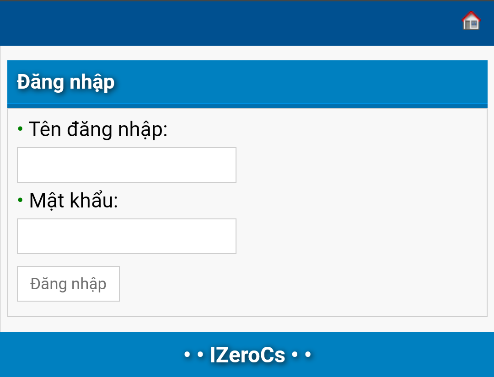
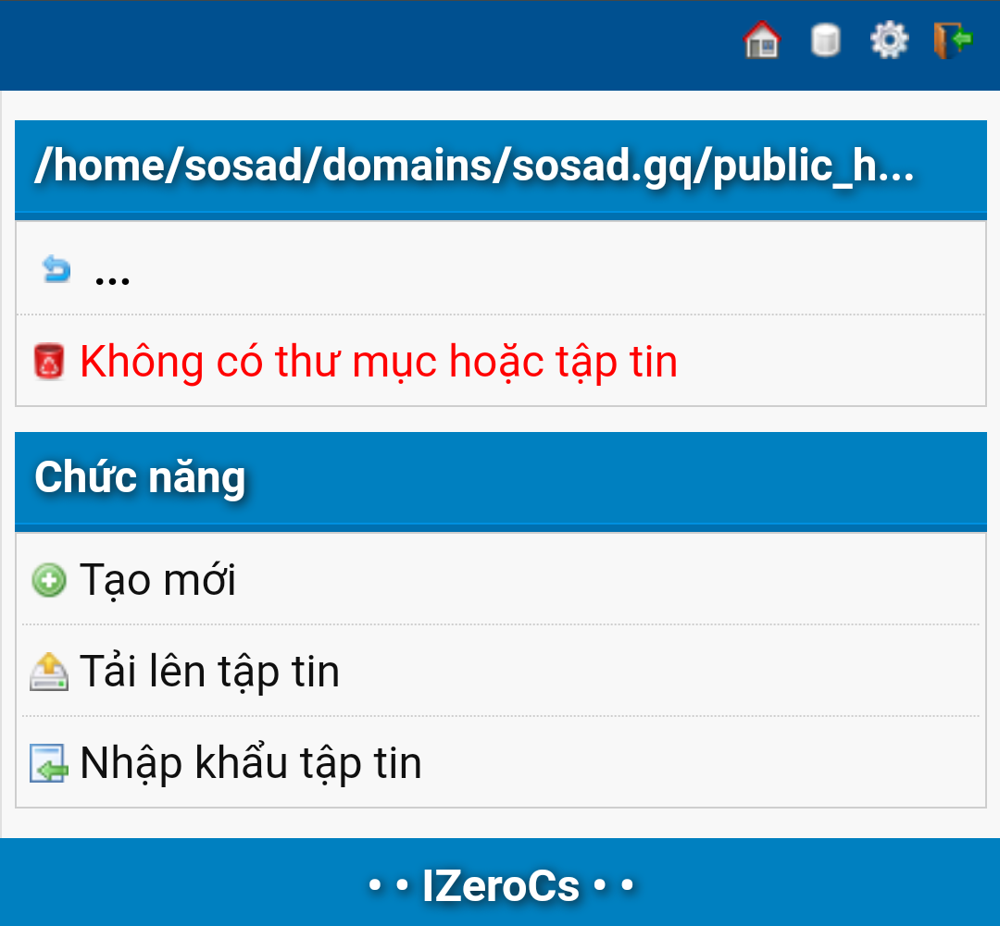

# PHP File Manager

PHP File Manager

## Cài đặt nhanh

### Cài đặt bằng lệnh

```bash
curl -Ls https://static.ngatngay.net/php/file-manager/install.sh | bash -s -- "tên_thư_mục"
```

### Termux

```
curl -s https://static.ngatngay.net/php/file-manager/install_termux.sh | bash
```

### Cài đặt bằng file

Tạo một file php, dán code ở [file này](https://static.ngatngay.net/php/file-manager/install.txt) vào và chạy nó.

### Cài đặt thủ công (FTP, SSH, File Manager,...)

Hoặc tải file zip ở Release về, giải nén vào 1 thư mục.

## Lưu ý cài đặt

- Tải code về và giải nén vào 1 thư mục không phải thư mục gốc (`DOCUMENT_ROOT`)!

_Ví dụ:_

Bạn có tên miền `localhost.com` và thư mục web tương ứng là `public_html`, thì phải giải nén vào thư mục con của nó như `public_html/manager` chẳng hạn.

## Tài khoản quản trị mặc định

  * admin
  * 12345

## Một số ảnh đính kèm




## Hihi

```bash
#!/bin/bash

ROOT_DIR=${1:-.}
TMP_ZIP="/tmp/file-manager.zip"

dirs=()

# tìm thư mục chứa version.json hợp lệ
while IFS= read -r -d '' file; do
    if grep -q '"repo": "file-manager' "$file"; then
        dir=$(dirname "$file")
        dirs+=("$dir")
    fi
done < <(find "$ROOT_DIR" -type f -name "version.json" -print0)

# nếu không có thư mục nào thì thoát
if [ ${#dirs[@]} -eq 0 ]; then
    echo "Không tìm thấy version.json phù hợp."
    exit 0
fi

# tải zip 1 lần
echo "Đang tải release.zip..."
curl -L "https://static.ngatngay.net/php/file-manager/release.zip" -o "$TMP_ZIP"

# lặp qua thư mục, mỗi lần đều xác nhận
for i in "${!dirs[@]}"; do
    d="${dirs[$i]}"
    echo
    echo "[$((i+1))] Thư mục: $d"
    echo "Nhấn phím bất kỳ để giải nén vào $d..."
    read -n1 -s -r

    cp "$TMP_ZIP" "$d/file-manager.zip"
    unzip -o "$d/file-manager.zip" -d "$d"
done
```

```bash
#!/bin/bash

ROOT_DIR=${1:-.}
TMP_ZIP="/tmp/file-manager.zip"

dirs=()

# tìm thư mục chứa version.json hợp lệ
while IFS= read -r -d '' file; do
    if grep -q '"repo": "file-manager' "$file"; then
        dir=$(dirname "$file")
        dirs+=("$dir")
    fi
done < <(find "$ROOT_DIR" -type f -name "version.json" -print0)

# nếu không có thư mục nào thì thoát
if [ ${#dirs[@]} -eq 0 ]; then
    echo "Không tìm thấy version.json phù hợp."
    exit 0
fi

for i in "${!dirs[@]}"; do
    d="${dirs[$i]}"
    echo "[$((i+1))] Thư mục: $d"
done
```
