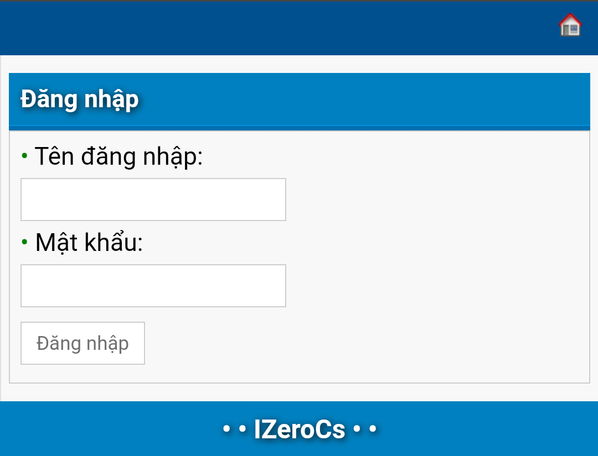
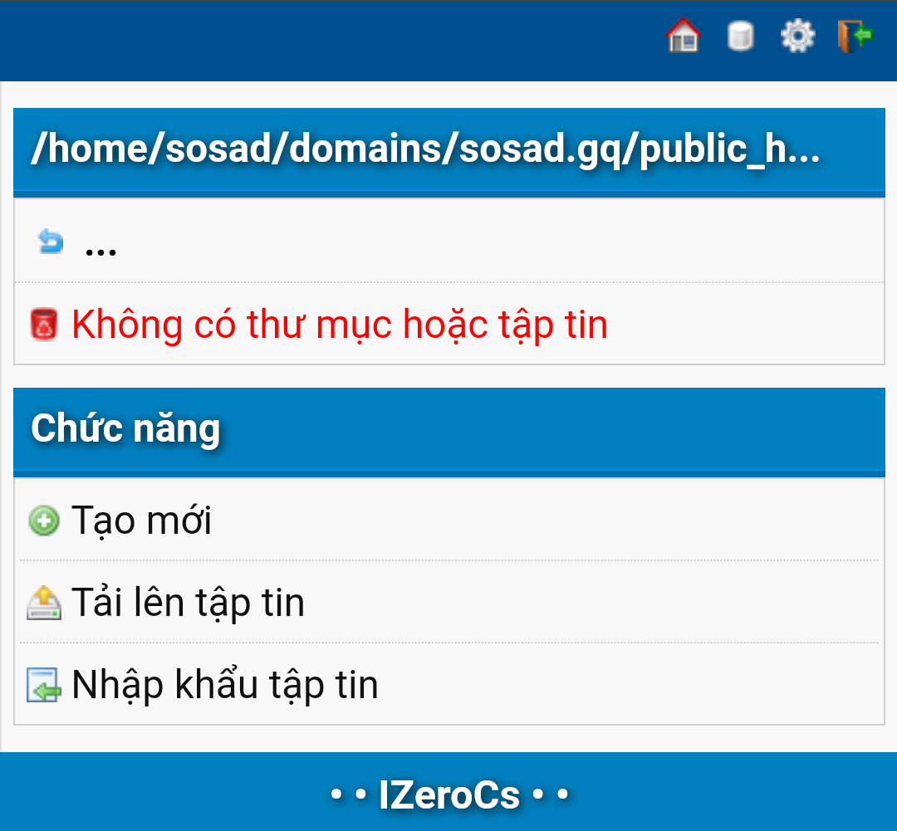

# PHP File Manager

PHP File Manager

## Cài đặt nhanh

### Cài đặt bằng file php

Tạo một file php, dán code ở [file này](https://static.nightmare.top/app/file-manager-php/install_php) vào và chạy nó.

### Cài đặt thủ công (FTP, SSH, File Manager,...)

Tải file zip ở Release về, giải nén vào 1 thư mục.

### Shell (Bash)

cd to dir manager

```
cd manager
```

run

```
curl -s https://static.nightmare.top/app/file-manager-php/install_upgrade_sh | bash
```

### Cài đặt cho Unix Systemd

```bash
curl -Ls https://static.nightmare.top/app/file-manager-php/install_unix | bash
```

### Termux

```
curl -s https://static.nightmare.top/app/file-manager-php/install_termux | bash
```

## Lưu ý cài đặt

Bạn có tên miền `localhost.com` và thư mục web tương ứng là `public_html`, thì phải giải nén vào thư mục con của nó như `public_html/manager` chẳng hạn.

## Tài khoản quản trị mặc định

  * `admin`
  * `!!!123456789!!!`

## Một số ảnh đính kèm




